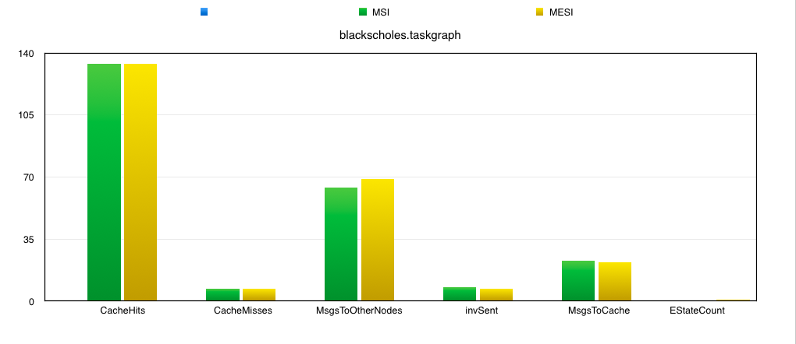

# Overview
Syncdsim is a directory-based cache coherence simulator that supports MSI and MESI (more to come). It takes in memory reference traces, simulates cache and directory traffic, and finally analyzes/reports the behaviors. 

# Background
## Motivation
Cache coherence is one of the most important topics in designing multi-processor caches. In the lectures, we discussed both snooping-based and directory-based cache coherence protocols. Comparing to snooping-based which relies heavily on broadcasting on the entire bus, directory-based protocols seems to be more scalable with regard to number of processors as it allows point-to-point communication. Therefore, we decide to develop a deeper understanding of the various directory-based cache coherence protocols by actually implementing them and observe cache behavior of programs with distinct memory traces. We hope that our project would eventually come available as a tool for programmers who are interested in knowing the cache behavior and memory reference characteristics of their programs, which could potentially be helpful in optimizing the code. 

# Design
## Simulator
## Context

## Processor
Processor is responsible for getting memory operations from a Task. It keeps a queue of MemoryAction objects that contain an address and an associated memory action type (e.g. a action_type_mem_read), and feeds the memory actions to protocol handler one at a time, and only when the previous memory action has finished. When the queue runs empty, the processor tries to fetch a new Task if one is available, and pre-processes the address of a memory action to be 64-byte aligned (which is the size of a cache line). In the case when a memory address spans two lines, processor will split that Memory Action into two, that have identical memory action types.

## Cache

## Directory

## Protocol Handler
Protocol Handler knows well about the protocol and its state transitions. It talks to Directory, Cache, and other nodes in order to service a MemoryAction from its own processor, or a message from its incoming message queue. 

1. Service a MemoryAction from its own processor

Protocol Handler maintain a map that stores the current state of a line in its own cache. The state could be "MODIFIED", "SHARED", or "INVALID" if the protocol is MSI, with an extra "EXCLUSIVE" state in MESI. To service a MemoryAction, it checks to see the current state of the line, and decides whether it could just read from/write to its own Cache, or it actually has to communicate with the home node. If latter, it will choose the message type based on the current protocol being used. For cache-related messages, Protocol Handler adds the message to the message queue of local cache. For other messages, it puts the message on other Context's incoming message queue. As an example, in *MSI*, the correct message type for all combinations would look like:

| Cache Line Status | Memory Action | Msg Type         | Description                                       |
|-------------------|---------------|------------------|---------------------------------------------------|
| MODIFIED          | READ          | CACHE_READ       | read from local cache                             |
| MODIFIED          | WRITE         | CACHE_UPDATE     | write to local cache                              |
| SHARED            | READ          | CACHE_READ       | read from local cache                             |
| SHARED            | WRITE         | INVALIDATE_OTHER | ask the home node to invalidate all other sharers |
| INVALID           | READ          | READ_MISS        | ask the home node for a line to read              |
| INVALID           | WRITE         | WRITE_MISS       | ask the home node for a line to write             |

2. Service a message from its incoming message queue

Each cycle, a Protocol Handler will check its incoming queue for serviceable messages, and reacts accordingly. If the message has type INVALIDATE_OTHER, READ_MISS, or WRITE_MISS, then it's possible that another message with regard to the same memory address is currently being serviced. In that case, the later message could not be serviced right away, hence will be put in to a blocked message queue for that address. If the message is serviceable, Protocol Handler will check whether it could reply immediately, or it needs to relay it to owners/sharers of the line.

Another category of messages are those from home node that asks the protocol Handler to "do something" about a particular cache line. The message type could be INVALIDATE (S -> I), FETCH_INVALIDATE (M -> I), or just FETCH (M -> S). It's also possible that home node has sent an ACK for a line we previously requested. Upon getting those messages, Protocol Handler will modify the cache line status for this line, and send out a message to its own cache.

Finally, Protocol Handler could be getting messages from its local cache, in most cases an ACK for a cache action. For those messages, Protocol Handler either replies to home node with an ACK, or completes its current Memory Action (which means Processor could go ahead and fetch the next one), based on the specific type of that ACK message. 

# Correctnest Test
## Basic correctness
We tested the correctness for both MSI and MESI by creating a small sequence of memory operations for a number of processors. We sketched out the behaviors of each component as well as their communication that we expect to observe during each cycle, and then carefully verifies the result with our simulator output. 

Since our project is designed to take in a taskGraph file and parse the taskGraph for assigning tasks(groups of mem ops) to each processor, we had to do a bit of hacking to "inject" our mem ops into an existing taskGraph, that is to replace the original mem ops in the graph with our own ops. 

This approach is useful in getting some basic correctness verified, but it's extremely non-scalable as the complexity grows fast with number of mem ops.

The example mem op sequence and expected behavior of simulator for MESI can be found [here]( https://docs.google.com/a/andrew.cmu.edu/document/d/1DDc1RicXqDVquXbJmqvOqBLhzjSF1iNKCU6ISPp7JIg/edit?usp=sharing)

The example mem op sequence and expected behavior of simulator for MESI can be found [here]( https://docs.google.com/document/d/1j2hKFtNprdb43laDmoDHZk0d-TV_UeslHpxe_8zuYuM/edit?usp=sharing)

# Analysis
For the analysis we ran a small taskGraph with memOps per task capped at 5 (to be able to finish quickly). However, the analyzation can be extended to any number of memOps per task. Here we see that cacheHits and cacheMisses for both MSI and MESI remain same as irrespective of the fact that a line is found in an exclusive state or modified state in MESI during a write it's still a cacheHit. The other conditions of cacheHit remain same across MSI and MESI and hence this count is same.
Same argument is applied to cacheMiss. Here comes the interesting part - EStateCount represents the number of times a line is found in exclusive state. That is 1 for this file in MESI count and subsequently numInvalidations sent out is 1 less in MESI as the node does not send out invalidates for a write to exclusive state. Whereas the same line was in a Modified state in MSI and an invalidate was sent out for it. Number of messages sent to other nodes by a node is more in MESI protocol as a home node sends out a FETCH to a node containing a line in E state when another node sends a READ_MISS as the node holding the line in E state might have written to it. However, when a node sends a READ_MISS for a line that is in Shared state, the home node does not send any messages to any of the sharers as the line has not been modified since last written. This is not guaranteed when a node holds a line in E state in MESI (it might have migrated to M). As for the messages sent to cache, that increases in MESI because we send out a CACHE_FETCH when we get a request to FETCH a line that is held in an E state in MESI from the home node of that line upon receiving a READ_MISS from another node.

More comparisons to follow!

TestAndSet vs Test-TestAndSet - To be able to compare the results from test-testAndSet and testAndSet in MESI protocol to see how does the protocolHandler react to different types of reads and writes (in tas we issue a read-modify-write causing invalidations while in ttas we issue a read until invalidated by the owner) we wrote two small cpp files and professor Railing very generously provided us with taskGraphs for those. We are in the process of analysing and generating results from those!

# Conclusion
